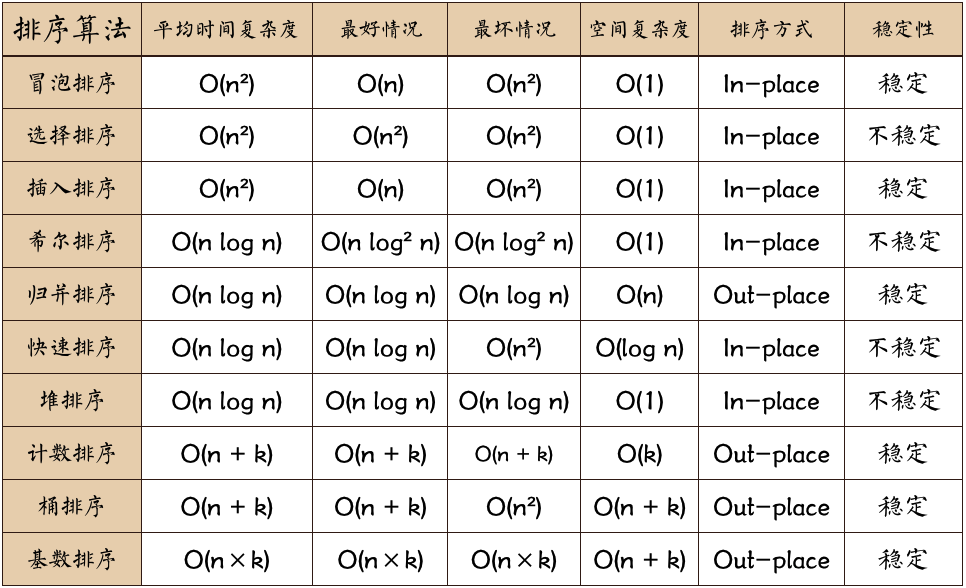

## 名词解释：
- n：数据规模
- k：桶的个数
- In-place: 占用常数内存空间，不占用额外内存空间
- Out-Place: 占用额外内存空间
- 稳定性： 排序后2个相等键值的顺序与排序之前的顺序相同就是稳定的

## 1.冒泡排序


```js
function bubble(arr){
    let length = arr.length;
    for(let i = 0;i < length;i++){
       for(let j = 0;j < length-i-1;j++){
           if(arr[j] > arr[j+1]){
               let tmp = arr[j+1];
               arr[j+1] = arr[j];
               arr[j] = tmp;
           }
       }
    }
    return arr;
}
```

- 冒泡排序总结：
- 平均时间复杂度：O(n<sup>2</sup>)
- 最好情况(数组已经是排好的顺序时,也就是if条件一直不满足)：
- 最坏情况(数组是反序)：
- 空间复杂度：
- 稳定性：

## 2.选择排序


```Javascript
function selectionSort(arr){
    let len = arr.length;
    let minIndex,tmp;
    for(let i = 0;i < len -1;i++){
        minIndex = i;
        for(let j = i + 1;j < len;j++){
            if(arr[j] < arr[minIndex]){
                minIndex = j;
            }
        }
        tmp = arr[i];
        arr[i] = arr[minIndex];
        arr[minIndex] = tmp;
    }
}
```
- 选择排序总结：
- 平均时间复杂度：O(n<sup>2</sup>)
- 最好情况(数组已经是排好的顺序时,也就是if条件一直不满足)：
- 最坏情况(数组是反序)：
- 空间复杂度：
- 稳定性：

## 3.插入排序


```Javascript
function insertionSort(arr) {
    var len = arr.length;
    var preIndex, current;
    for (var i = 1; i < len; i++) {
        preIndex = i - 1;
        current = arr[i];
        while(preIndex >= 0 && arr[preIndex] > current) {
            arr[preIndex+1] = arr[preIndex];
            preIndex--;
        }
        arr[preIndex+1] = current;
    }
    return arr;
}

```

- 插入排序总结：
- 平均时间复杂度：O(n<sup>2</sup>)
- 最好情况(数组已经是排好的顺序时,也就是if条件一直不满足)：
- 最坏情况(数组是反序)：
- 空间复杂度：
- 稳定性：

## 4.希尔排序
- 希尔排序是插入排序的一种更高效率的实现
- 它与插入排序的不同之处在于，它会优先比较距离较远的元素。希尔排序的核心在于间隔序列的设定
- 既可以提前设定好间隔序列，也可以动态的定义间隔序列
- 动态定义间隔序列的算法是《算法（第4版》的合著者Robert Sedgewick提出的。在这里，我就使用了这种方法。

```js
function shellSort(arr) {
    var len = arr.length,
        temp,
        gap = 1;
    while(gap < len/3) {          //动态定义间隔序列
        gap =gap*3+1;
    }
    for (gap; gap > 0; gap = Math.floor(gap/3)) {
        for (var i = gap; i < len; i++) {
            temp = arr[i];
            for (var j = i-gap; j >= 0 && arr[j] > temp; j-=gap) {
                arr[j+gap] = arr[j];
            }
            arr[j+gap] = temp;
        }
    }
    return arr;
}
```

- 希尔排序总结：
- 平均时间复杂度：O(n<sup>2</sup>)
- 最好情况(数组已经是排好的顺序时,也就是if条件一直不满足)：
- 最坏情况(数组是反序)：
- 空间复杂度：
- 稳定性：

## 5.归并排序


```js
function mergeSort(arr) {  //采用自上而下的递归方法
    var len = arr.length;
    if(len < 2) {
        return arr;
    }
    var middle = Math.floor(len / 2),
        left = arr.slice(0, middle),
        right = arr.slice(middle);
    return merge(mergeSort(left), mergeSort(right));
}

function merge(left, right)
{
    var result = [];

    while (left.length && right.length) {
        if (left[0] <= right[0]) {
            result.push(left.shift());
        } else {
            result.push(right.shift());
        }
    }

    while (left.length)
        result.push(left.shift());

    while (right.length)
        result.push(right.shift());

    return result;
}
```
作为一种典型的分而治之思想的算法应用，归并排序的实现由两种方法：

自上而下的递归（所有递归的方法都可以用迭代重写，所以就有了第2种方法）
自下而上的迭代
在《数据结构与算法JavaScript描述》中，作者给出了自下而上的迭代方法。但是对于递归法，作者却认为：

However, it is not possible to do so in JavaScript, as the recursion goes too deep
for the language to handle.
然而,在 JavaScript 中这种方式不太可行,因为这个算法的递归深度对它来讲太深了。

说实话，我不太理解这句话。意思是JavaScript编译器内存太小，递归太深容易造成内存溢出吗？还望有大神能够指教。
和选择排序一样，归并排序的性能不受输入数据的影响，但表现比选择排序好的多，因为始终都是O(n log n）的时间复杂度。代价是需要额外的内存空间

- 归并排序总结：
- 平均时间复杂度：O(n<sup>2</sup>)
- 最好情况(数组已经是排好的顺序时,也就是if条件一直不满足)：
- 最坏情况(数组是反序)：
- 空间复杂度：
- 稳定性：

## 6.快速排序


```js
function quickSort(arr, left, right) {
    var len = arr.length,
        partitionIndex,
        left = typeof left != 'number' ? 0 : left,
        right = typeof right != 'number' ? len - 1 : right;

    if (left < right) {
        partitionIndex = partition(arr, left, right);
        quickSort(arr, left, partitionIndex-1);
        quickSort(arr, partitionIndex+1, right);
    }
    return arr;
}

function partition(arr, left ,right) {     //分区操作
    var pivot = left,                      //设定基准值（pivot）
        index = pivot + 1;
    for (var i = index; i <= right; i++) {
        if (arr[i] < arr[pivot]) {
            swap(arr, i, index);
            index++;
        }        
    }
    swap(arr, pivot, index - 1);
    return index-1;
}

function swap(arr, i, j) {
    var temp = arr[i];
    arr[i] = arr[j];
    arr[j] = temp;
}
```
又是一种分而治之思想在排序算法上的典型应用
本质上来看，快速排序应该算是在冒泡排序基础上的递归分治法。
快速排序的名字起的是简单粗暴，因为一听到这个名字你就知道它存在的意义，就是快，而且效率高!
它是处理大数据最快的排序算法之一了。
虽然Worst Case的时间复杂度达到了O(n²)，但是人家就是优秀，在大多数情况下都比平均时间复杂度为O(n log n) 的排序算法表现要更好
可是这是为什么呢，我也不知道。。。好在我的强迫症又犯了，查了N多资料终于在《算法艺术与信息学竞赛》上找到了满意的答案：
快速排序的最坏运行情况是O(n²)，比如说顺序数列的快排。但它的平摊期望时间是O(n log n) ，且O(n log n)记号中隐含的常数因子很小
比复杂度稳定等于O(n log n)的归并排序要小很多。所以，对绝大多数顺序性较弱的随机数列而言，快速排序总是优于归并排序。

- 快速排序总结：
- 平均时间复杂度：O(n<sup>2</sup>)
- 最好情况(数组已经是排好的顺序时,也就是if条件一直不满足)：
- 最坏情况(数组是反序)：
- 空间复杂度：
- 稳定性：

## 7.堆排序


```js
var len;    //因为声明的多个函数都需要数据长度，所以把len设置成为全局变量

function buildMaxHeap(arr) {   //建立大顶堆
    len = arr.length;
    for (var i = Math.floor(len/2); i >= 0; i--) {
        heapify(arr, i);
    }
}

function heapify(arr, i) {     //堆调整
    var left = 2 * i + 1,
        right = 2 * i + 2,
        largest = i;

    if (left < len && arr[left] > arr[largest]) {
        largest = left;
    }

    if (right < len && arr[right] > arr[largest]) {
        largest = right;
    }

    if (largest != i) {
        swap(arr, i, largest);
        heapify(arr, largest);
    }
}

function swap(arr, i, j) {
    var temp = arr[i];
    arr[i] = arr[j];
    arr[j] = temp;
}

function heapSort(arr) {
    buildMaxHeap(arr);

    for (var i = arr.length-1; i > 0; i--) {
        swap(arr, 0, i);
        len--;
        heapify(arr, 0);
    }
    return arr;
}
```

堆排序可以说是一种利用堆的概念来排序的选择排序。分为两种方法：

大顶堆：每个节点的值都大于或等于其子节点的值，在堆排序算法中用于升序排列
小顶堆：每个节点的值都小于或等于其子节点的值，在堆排序算法中用于降序排列

## 8.计数排序


```Javascript
function countingSort(arr, maxValue) {
    var bucket = new Array(maxValue+1),
        sortedIndex = 0;
        arrLen = arr.length,
        bucketLen = maxValue + 1;

    for (var i = 0; i < arrLen; i++) {
        if (!bucket[arr[i]]) {
            bucket[arr[i]] = 0;
        }
        bucket[arr[i]]++;
    }

    for (var j = 0; j < bucketLen; j++) {
        while(bucket[j] > 0) {
            arr[sortedIndex++] = j;
            bucket[j]--;
        }
    }

    return arr;
}
```
计数排序的核心在于将输入的数据值转化为键存储在额外开辟的数组空间中。
作为一种线性时间复杂度的排序，计数排序要求输入的数据必须是有确定范围的整数。


## 9.桶排序

```JavaScript
function bucketSort(arr, bucketSize) {
    if (arr.length === 0) {
      return arr;
    }

    var i;
    var minValue = arr[0];
    var maxValue = arr[0];
    for (i = 1; i < arr.length; i++) {
      if (arr[i] < minValue) {
          minValue = arr[i];                //输入数据的最小值
      } else if (arr[i] > maxValue) {
          maxValue = arr[i];                //输入数据的最大值
      }
    }

    //桶的初始化
    var DEFAULT_BUCKET_SIZE = 5;            //设置桶的默认数量为5
    bucketSize = bucketSize || DEFAULT_BUCKET_SIZE;
    var bucketCount = Math.floor((maxValue - minValue) / bucketSize) + 1;   
    var buckets = new Array(bucketCount);
    for (i = 0; i < buckets.length; i++) {
        buckets[i] = [];
    }

    //利用映射函数将数据分配到各个桶中
    for (i = 0; i < arr.length; i++) {
        buckets[Math.floor((arr[i] - minValue) / bucketSize)].push(arr[i]);
    }

    arr.length = 0;
    for (i = 0; i < buckets.length; i++) {
        insertionSort(buckets[i]);                      //对每个桶进行排序，这里使用了插入排序
        for (var j = 0; j < buckets[i].length; j++) {
            arr.push(buckets[i][j]);                      
        }
    }

    return arr;
}
```
桶排序是计数排序的升级版。它利用了函数的映射关系，高效与否的关键就在于这个映射函数的确定。
为了使桶排序更加高效，我们需要做到这两点：

在额外空间充足的情况下，尽量增大桶的数量
使用的映射函数能够将输入的N个数据均匀的分配到K个桶中
同时，对于桶中元素的排序，选择何种比较排序算法对于性能的影响至关重要。

什么时候最快（Best Cases）：
当输入的数据可以均匀的分配到每一个桶中

什么时候最慢（Worst Cases）：
当输入的数据被分配到了同一个桶中


## 10.基数排序


```js
//LSD Radix Sort
var counter = [];
function radixSort(arr, maxDigit) {
    var mod = 10;
    var dev = 1;
    for (var i = 0; i < maxDigit; i++, dev *= 10, mod *= 10) {
        for(var j = 0; j < arr.length; j++) {
            var bucket = parseInt((arr[j] % mod) / dev);
            if(counter[bucket]==null) {
                counter[bucket] = [];
            }
            counter[bucket].push(arr[j]);
        }
        var pos = 0;
        for(var j = 0; j < counter.length; j++) {
            var value = null;
            if(counter[j]!=null) {
                while ((value = counter[j].shift()) != null) {
                      arr[pos++] = value;
                }
          }
        }
    }
    return arr;
}
```

基数排序须知：
基数排序有两种方法：

MSD 从高位开始进行排序
LSD 从低位开始进行排序
基数排序 vs 计数排序 vs 桶排序
这三种排序算法都利用了桶的概念，但对桶的使用方法上有明显差异：
基数排序：根据键值的每位数字来分配桶
计数排序：每个桶只存储单一键值
桶排序：每个桶存储一定范围的数值