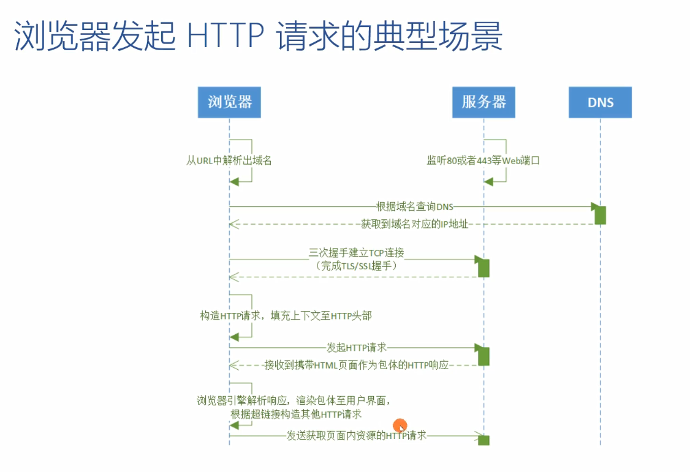
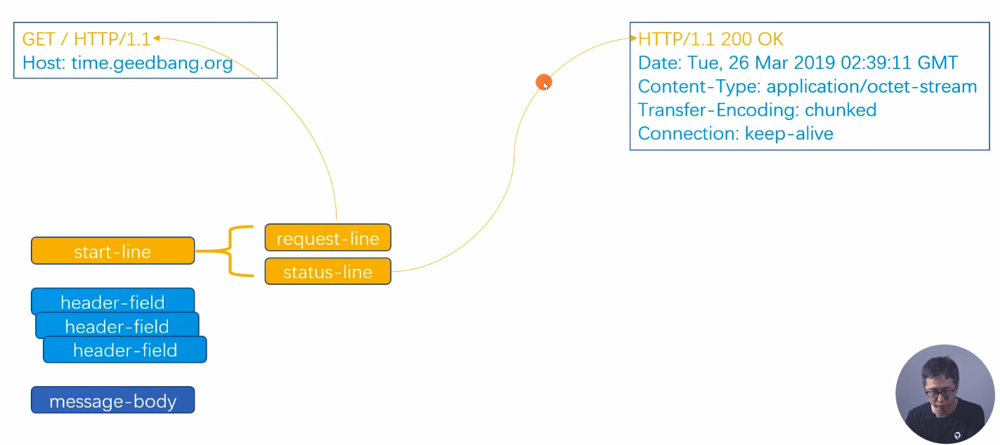
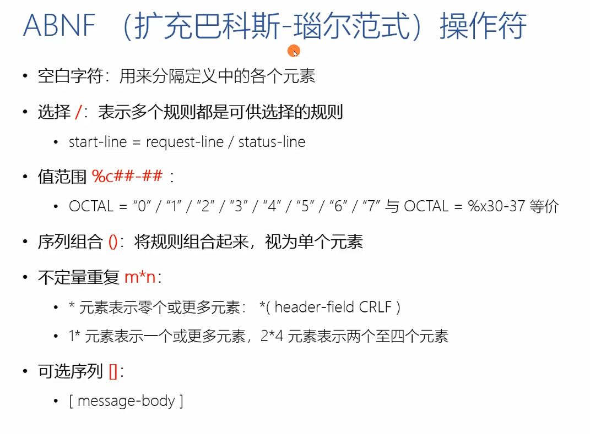
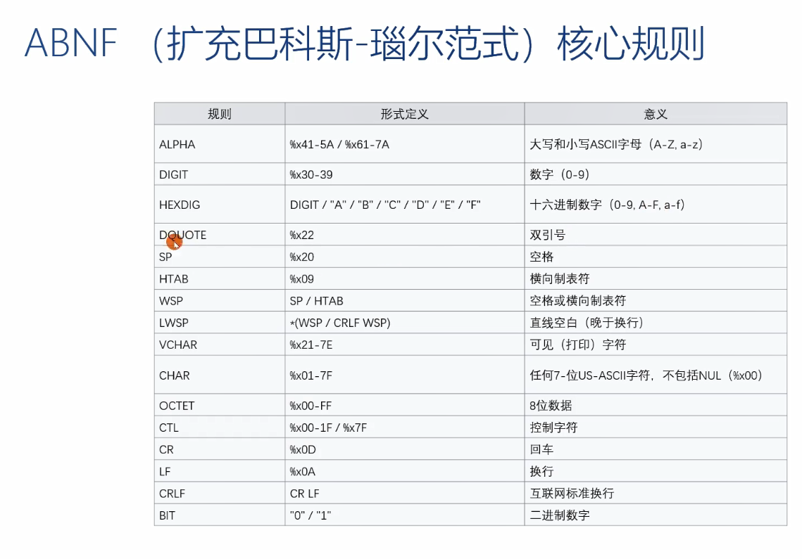
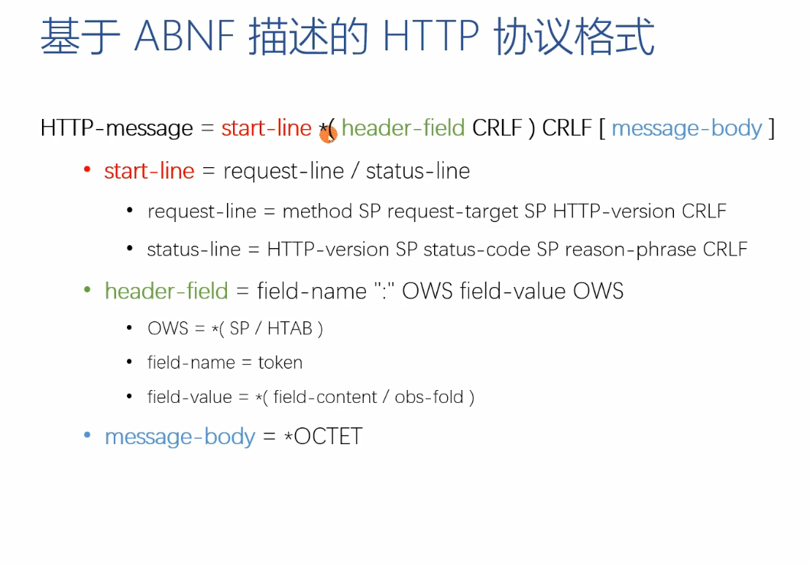

# 工具使用 
- `chrome`浏览器`NewWork`面板 
- `WireShark` 
- `tcpdump`
-------------------------------------------
-------------------------------------------
# 应用层
## HTTP/1
- `HTTP(Hypertext Transfer Protocol)`超文本传输协议 
  + 一种应用层的,无状态的,以请求和应答方式运行的协议
  + 使用可扩展的语义和自描述消息格式
  + 与基于网络的超文本信息系统灵活的互动 

- HTTP协议的格式(基于`ABNF`主义的定义)

- HTTP/1 协议为什么会如此设计?  
  + 网络分层原理,`REST`架构 
  + 问题:`HTTP1`不支持服务器推送消息的`webSocket`协议
- 协议的通用规则 
  + 协议格式 
  + `URI` 
  + 方法与响应码概览 
- 连接与消息的路由 
- 内容协商与传输 
- `cookie`的设计与问题 
- 缓存的控制  
## HTTP/1.1 Websocket
- 建立会话
- 消息传输
- 心跳
- 关闭会话

## HTTP/2.0

-------------------------------------------
-------------------------------------------
# 应用层安全基础设施 
## TLS/SSL
-------------------------------------------
-------------------------------------------
# 传输层
## TCP 
-------------------------------------------
-------------------------------------------
# 网络层及数据链路层
## IP层和以太网